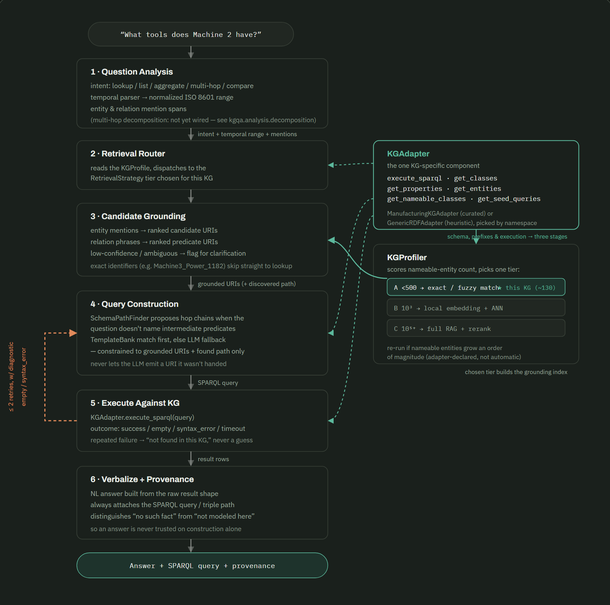

# KGQA

Natural-language question answering over knowledge graphs (RDF/OWL). Upload
a Turtle/RDF-XML/N3/N-Triples file and ask questions in plain English; the
pipeline grounds entities and properties, constructs a SPARQL query, runs
it, and verbalizes the result.



A curated adapter is included for an Industry 4.0 production-line
ontology(https://www.semantic-web-journal.net/content/benchmark-dataset-knowledge-graph-generation-industry-40-production-lines), with 5 built-in query templates covering its common question
shapes. Any other knowledge graph is grounded with a generic heuristic and
answered entirely through an LLM fallback (Hugging Face Inference API).

## Setup

```bash
pip install -r requirements.txt
```

Python 3.10+.

## Run

```bash
python app.py
```

This launches a Gradio UI: upload a KG file, wait for it to load, then ask
questions. To answer anything outside the 5 built-in templates, supply a
Hugging Face API token in the UI (or set the `HF_TOKEN` environment
variable) -- this is required for any knowledge graph other than the
reference one, since the templates are specific to its predicates.

## Using it as a library

```python
from kgqa.pipeline import KGQAPipeline

pipeline = KGQAPipeline("path/to/graph.ttl")
answer = pipeline.answer("What tools does Machine 2 have?")
print(answer.text)
print(answer.sparql_query)
```

## Project layout

- `kgqa/adapters/` -- KG access layer (`KGAdapter` interface, generic
  rdflib-backed implementation, curated reference-KG adapter)
- `kgqa/profiler/` -- profiles a loaded KG and picks a retrieval tier
- `kgqa/retrieval/` -- entity/property grounding strategies (exact/fuzzy
  match; embedding-based tiers are stubbed, not implemented)
- `kgqa/analysis/` -- intent classification, temporal expression parsing
  (multi-hop decomposition is stubbed, not implemented)
- `kgqa/construction/` -- SPARQL query construction: a template bank for
  known question shapes, a schema path finder, and an LLM fallback for
  everything else
- `kgqa/execution/` -- runs a query, classifies the outcome, retries on
  failure with a diagnostic payload
- `kgqa/verbalization/` -- turns a query result into a natural-language
  answer
- `kgqa/eval/` -- execution-accuracy eval harness (compares result sets,
  not query text) and a small sample question set
- `app.py` -- Gradio UI wiring the above together


## Citations
[1] @article{yahya2024benchmark,
  title={A benchmark dataset with Knowledge Graph generation for Industry 4.0 production lines},
  author={Yahya, Muhammad and Ali, Aabid and Mehmood, Qaiser and Yang, Lan and Breslin, John G and Ali, Muhammad Intizar},
  journal={Semantic Web},
  volume={15},
  number={2},
  pages={461--479},
  year={2024},
  publisher={SAGE Publications Sage UK: London, England}
}
